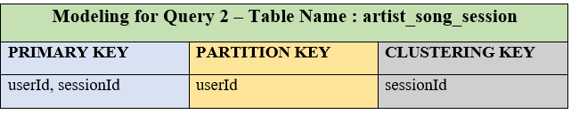

# Project : Data Modeling With Cassandra

## Current Scenario
A startup named Sparkify wants to analyze the data they have been collecting on songs and user activity on their new music streaming app.
* The analysis team would like to know what songs users are listening to
* As the data resides in a directory of CSV files on user activity on the app, the data cannot be queried easily to generate results

## Sparkify's Goals
   The newly hired Data Engineer:
   * should create an Apache Cassandra database which can create queries on song play to anser questions

## Data Engineer Role
   1. Create a Cassandra database for the above analysis
   2. Test the database by running three queries provided by the analytics team from Sparkify to ceate the results

#### Queries provided by the analytics team
Three queries are created to pose the following questions based on the data 

**Query 1.** 
Display the **artist, song title and song length** in the music app history that was heard during  sessionId = 338 and itemInSession = 4 

* The first field, **sessionId**, in the above primary key is hashed to generate the partition key.
* The second field, **itemInSession**, is the clustering key used for sorting within a partition. 

**Query 2.** 
Display the **name of artist, song (sorted by itemInSession),** the **first name and last name**  
of the user for **userId =10**, **sessionId = 182**  

* The first field, **userId**, in the above primary key is hashed to generate the partition key.
* The second field, **sessionId**, is the clustering key used for sorting within a partition. 

**Query 3.** 
Display the **first name** and **last name** of every user</b> in the music app history who 
listened to the song **<mark>'All Hands Against His Own'</mark>** 

* The first field, **songTitle**, in the above primary key is hashed to generate the partition key.
* The second field, **userId**, is the clustering key used for sorting within a partition. 

#### Input Datasets and Other Workspace Files
1. The datset event_data
2. The directory of CSV files partitioned by date. 
Example:  
* **event_data/2018-11-08-events.csv**
* **event_data/2018-11-09-events.csv**

<mark>**Snapshot of event_datafile_new.csv**</mark> 

3. **Create a table for Query 3 with primary key and columns based on the Query 3 Model above**
4. Process the event data files to create a smaller event data csv file called  **event_datafile_new.csv**  that will be used to insert data into the Cassandra tables.

5. **Project_1B_Project_Template.ipynb**, is the Jupyter notebook which contains the ETL code
   and the Apache Cassandra Code

### Project Steps
#### <mark>A. Prepare an ETL Pipeline for Pre-Processing the Files</mark>
#####  A.1. Import Python packages -- pandas, casandra, re, os, glob, numpy, json, csv 
#####  A.2. We iterate through each event file in event_data to process a new CSV file in Python which will be processed
 
#### <mark>B. Implementing Code in Apache Cassandra</mark>
##### B.1. Create a Cluster - establish a connection to begin executing queries
##### B.2. Create a Keyspace
     
#### <mark>B.3 Query 1 Implementation</mark>   
##### B.3.1. Model a table, **artist_song_itemInSession**, based on Query 1
**Create a table for Query 1 with primary key and columns based on the Query 1 Model above**
##### B.3.2. Setup the CSV file and Insert Statement for Query 1 to load processed records into the Query 1 table
##### B.3.3. Execute a select statement for Query 1 to verify data ingestion 

#### <mark>B.4 Query 2 Implementation</mark>    
##### B.4.1. Model a table, **artist_song_session**, based on Query 2
**Create a table for Query 2 with primary key and columns based on the Query 2 Model above**
##### B.4.2. Setup the CSV file and Insert Statement for Query 2 to load processed records into the Query 2 table
##### B.4.3. Execute a select statement for Query 2 to verify data ingestion 

#### <mark>B.5 Query 3 Implementation</mark>     
##### B.5.1. Model a table, **user_song_preference**  based on Query 3
**Create a table for Query 3 with primary key and columns based on the Query 3 Model above**
##### B.5.2. Setup the CSV file and Insert Statement for Query 3 to load processed records into the Query 3 table
##### B.5.3. Execute a select statement for Query 3 to verify data ingestion 
   
#### <mark>B.6 Drop Tables and close connections</mark>
##### Drop the tables created to reset the database and to test the pipeline
##### Close the session and cluster

#### <mark>C. Query Output</mark>
Pandas Dataframes were used to display the query output with customized column names relvant to the query output

#### <mark>D. Python and Notebook Environment</mark>
**Running in Udacity Workspace** 
Python 3, python packages, jupyter notebook, and terminal/console are available

#### References:
1.  <a href="https://shermandigital.com/blog/designing-a-cassandra-data-model/">Designing a Cassandra Data Model April 26, 2017 by Chris Sherman</a>

2. <a href="https://www.geeksforgeeks.org/display-the-pandas-dataframe-in-table-style/">Display the Pandas DataFrame in table style, Last Updated : 18 Aug, 2020</a>

3. <a href="https://pandas.pydata.org/pandas-docs/stable/reference/api/pandas.DataFrame.html">API Reference - pandas.DataFrame</a>

4. <a href="https://appdividend.com/2020/04/28/python-how-to-select-rows-from-pandas-dataframe/">Python: How To Select Rows From Pandas DataFrame, By Krunal, Last updated Apr 28, 2020</a>

5. <a href="https://www.guru99.com/cassandra-data-model-rules.html">Cassandra Data Model with Simple Example</a>

6. <a href="https://www.crazygeeks.org/questions/python-data-argument-cant-be-an-iterator">Python: data argument can't be an iterator</a>

7. <a href="https://www.geeksforgeeks.org/add-column-names-to-dataframe-in-pandas/">Add column names to dataframe in Pandas, Difficulty Level : Medium, Last Updated : 01 Aug, 2020</a>

8. <a href="https://www.tutorialspoint.com/python_pandas/python_pandas_dataframe.htm">Python Pandas - DataFrame</a>

9. <a href="https://cassandra.apache.org/doc/latest/data_modeling/intro.html">Apache Cassandra Data Modeling</a>

10. <a href="https://medium.com/analytics-vidhya/the-ultimate-markdown-guide-for-jupyter-notebook-d5e5abf728fd">The Ultimate Markdown Guide (for Jupyter Notebook), Hannan Satopay, Nov 18, 2019 · 10 min read"</a>

11. <a href="https://www.geeksforgeeks.org/set-pandas-dataframe-background-color-and-font-color-in-python/">Set Pandas dataframe background Color and font color in Python, Last Updated : 01 Aug, 2020</a>
